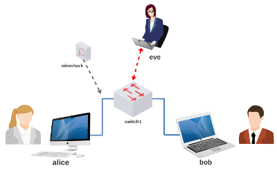

# Laboratório de Criptografia

**Passo 1**

Faça o download do laboratório:



[lab_cripto.tar.gz](lab_cripto.tar.gz)

**Passo 2**

Abra um terminal e digite:

```
$ cd Downloads
$ ls
$ tar -xvzf lab_cripto.tar.gz
$ ls
$ cd lab_cripto
$ ls
$ sudo py lab.py Seunome
```

Obs.: a senha é abc123.

**Passo 3**

Siga as instruções de aula: [Playlist no Youtube](https://www.youtube.com/playlist?list=PL4ySOdUYDU9AnsLbtvt7Mq3yBtnMT0Fog).
