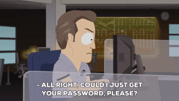

# Desafio 02 - Recuperação de Acesso

*Obs: este desafio contém informações que são meramente ilustrativas.*

**Cenário:**

Como analista de segurança você foi contratado para descobrir a senha que dá acesso à um importante sistema de fichários de uma empresa. Acompanhe o diálogo:

-x-x-x-x-

- Você: O que aconteceu? Qual é o problema?

*- Empresário: Semana passada Kenneth foi demitido da nossa empresa por justa causa. O problema é que Kenneth foi embora e não deixou a senha que dá acesso à um fichário da nossa empresa.*

- Você: Existem outros sistemas que ele utilizava? Pode haver senhas por lá.

*- Empresário: sim, vamos verificar.*

Pouco depois ...

*- Empresário: Olha só, ao investigarmos os computadores da empresa encontramos uma senha armazenada em outro sistema, mas ela não está legível: login=kenneth, password=afed82045057b0f132430f3d9565a997.*

- Você: Interessante. Poderia me dizer qual é o tamanho máximo da senha a ser digitada nesse sistema?

*- Empresário: estou testando aqui, ..., o sistema aceita apenas senhas com 6 caracteres exatamente. Estranho, mas é isso mesmo, deve ser a segurança dele.*

- Você: Fora isso, sabe de mais alguma informação?

*- Empresário: Apenas uma secretária da empresa nos relatou que uma vez Kenneth havia comentado que usava apenas vogais em suas senhas. Achava ele ser seguro.*

- Você: Bom, com essas informações eu acho que posso encontrar uma provável senha!

*- Empresário: Por favor, precisamos urgentemente.*

-x-x-x-x-

Com a posse de um arquivo do fichário ([ficha_secreta.zip](ficha_secreta.zip)) fornecido pelo empresário para você fazer testes, e sabendo que Kenneth tinha por costume utilizar a mesma senha em todos os sistemas, responda:

a) Qual é a senha de Kenneth?

b) Qual é o nome do personagem armazenado nessa ficha? 

Respostas:

a) eeauui

b) Kyle Broflovski 

