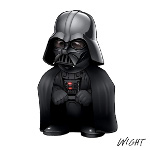
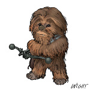

# Lista de Exercícios 07

Acompanhe as videoaulas APNP 06 e 07 na [Playlist](https://www.youtube.com/playlist?list=PL4ySOdUYDU9AnsLbtvt7Mq3yBtnMT0Fog).

**Exercício 1**

A palavra abaixo foi criptografada com o algoritmo AES-128-CBC e o seu resultado foi codificado em base64. Também foi utilizada a própria palavra como senha.

"chaves"

Qual foi o resultado criptografado?
  
a) 9VrkxX+ZaAnM+SKzT+gafwn82M3h1p7CT+JqJBJwgvo=

b) 74roikDny44YnfhLhfxFJA==

c) 1jp1QiyQ2orYCAqAMLgCGw==

d) 3yYkwAF6P8X/qFXtGGS0sQ==

e) U2FsdGVkX19NoYZdncGLqUGDda6wBbWldsry0oVDqGo=

**Exercício 2**

Descriptografe o arquivo abaixo:

[figura.des](figura.des)

Detalhes:

DES

salted=no

key=7AAEEC40FFE4C14D

iv =98FE9D0D81FC9AEA

base64=no

Responda: o que contém a figura?

a) Um personagem do Big Bang Theory.

b) Um personagem do Chaves.

c) Uma bandeira.

d) Um personagem dos Simpsons.

e) Um mascote.

**Exercício 3**

Criptografe o arquivo abaixo:

[arq.txt](arq.txt)

Algoritmo: AES-192-CBC

Salted: no

key=4B96D5C1FF312EEA069DDC760794963D63644473BE8ECB1B

iv =351E81E6C7E94AB31E29C129ADE7A04A

Base64: yes

Qual o conteúdo e a senha utilizada?

a)
Conteúdo: izCt2jHz6dqg3D0ecHu7Kw==

Senha: laranja

b)
Conteúdo: izCt2jHz6dqg3D0ecHu7Kw==

Senha: abacaxi

c)
Conteúdo: tnOP4bA7HXZ1L8J6/DvaMQ==

Senha: melancia

d)
Conteúdo: tnOP4bA7HXZ1L8J6/DvaMQ==

Senha: abacaxi

e)
Conteúdo: y7VLN7sMyR/WpZkIMyBOtQ==

Senha: melancia

f)
Conteúdo: y7VLN7sMyR/WpZkIMyBOtQ==

Senha: laranja

**Exercício 4**

Utilize as seguintes chaves e vetores de inicialização para descriptografar o arquivo abaixo:

[utfpr-2018.des3.nosalt.b64.txt](utfpr-2018.des3.nosalt.b64.txt) 

a)
key=6F84952F088A88D39DAD02606DAB509AF56CF45CF6AC2D09

iv =CEC70B5C5FF1C069

b)
key=7A7306BF1C0FCA1A1372C1175380FD53644CFCB400D3C5C8

iv =23D6CF8D4D8580B1

c)
key=93778FE39A5F1436BF324D9059662474F853F3A05902F596

iv =04D7916AD1B6A93D

d)
key=89709955E0591B3FD45935DEC9A5A438663156BC7083700D

iv =70EDD82FC55774E4

**Exercício 5**

O arquivo abaixo foi cifrado com as seguintes informações:

[file.bin](file.bin)

salt=36E123FFADF5C9F6

key=F75B8BD8FAC79DC43F80FC372ACDE5E7039C9EE83137D97A

iv =ACD6EA4D4BF48D74C32BA9A5FCA04FEA

Descubra o algoritmo da cifra:

a) DES

b) 3DES

c) AES-128-CBC

d) AES-192-CBC

e) AES-256-CBC

**Exercício 6**

Utilize as seguintes chaves e vetores de inicialização para descriptografar o arquivo abaixo:

[dc.des](dc.des)

Detalhes: DES, Base64, No Salt.

a)
key=AA42B234CB059157

iv =16C1434058FE1AEE

b)
key=A39401275D1B300A

iv =A789FB22AEA4148A

c)
key=84D961568A65073A

iv =3BCF0EB216B2A576

d)
key=EC0E2603172C73A8

iv =B644BB9456C1FF6E

e)
key=4E530843F5729388

iv =CDAB31CEE1A81ADA

**Exercício 7**

Descriptografe o arquivo abaixo:

[sw.des3](sw.des3)

Detalhes:

DES3

salted=no

key=8FF953DD97C4405234A04291DEE39E0B5308284EEA71855E

iv =012E837484E0DE1F

base64=yes

Responda: qual é a figura correspondente?

a) 

b) 

c) 

d) 

e) 

f) 

Respostas:

1 d/e)

2 e)

3 b)

4 a)

5 d)

6 a)

7 f)

