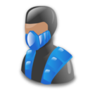
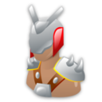

#  Lista de Exercícios 08

Acompanhe as videoaulas APNP 06, 07 e 08 na [Playlist](https://www.youtube.com/playlist?list=PL4ySOdUYDU9AnsLbtvt7Mq3yBtnMT0Fog).

*Obs: esta lista de exercícios contém informações que podem ser meramente ilustrativas.*

**Exercício 1**

Descriptografe o arquivo abaixo:

[flags.aes](flags.aes)

Parâmetros:
- AES
- 128 bits
- Eletronic Code Book
- Salt = 326A1EC57E38E444
- Key = AD3C4DE5903D65C411CEF2BB6656471E

Qual é a figura correspondente?

a) 

b) 

c) 

d) 

e) 

**Exercício 2**

Descubra o que está escrito no arquivo que está criptografado:

U2FsdGVkX1+p0XsJrAp/dVPkGVFNAFuK0qn4Ldn1b4M=

Dicas:
- Senha "123456"
- Criptografado com AES
- Foi utilizado o modo Eletronic Code Book

a) WE LOVE IT

b) DONT WORRY BE HAPPY

c) MADE IN CHINA

d) WINNERS DONT USE DRUGS

e) HASTA LA VISTA BABY

**Exercício 3**

Criptografe o arquivo abaixo em AES, 128 bits, modo CBC, e sem o "salted". Use a senha "consegui".

[aviso.txt](aviso.txt)

Qual será o conteúdo do arquivo resultante em base64?

a)h9i6c/TylPekVW9YrceIFeTecbYKuH6kJHZajKQZFeOyKh936q/Q/f838BZJ7Ucr
UwDmJgfx8XA=

b)GctLcxeS/yk9WhG3QhOXeLEm2VTXCZIr74XJCOOwRMHUdQdWvWzS8brUqYalaIv5
x38su3zuHvMyRFf0VVGYCQ==

c)U2FsdGVkX196w8zRY/w32KeFxtE2z/xO1WtRIpW/8cL70/dHGl4lDhVQ9H4skcdQ
nKHv6S7xJoZQf70M6+er4DJMGqiODM18e7fFOV9CQpY=

d)ZkjoQuL2r8Ogz47VhYxYI47aaeTcrJI59JPMGwEW8oKOcQxIR6xc/v48JqqCyyIT
iFUv6YFamnLUKYxpVoZScw==

e)U2FsdGVkX18f5FSKGcpNH8QaqgXiJe6/DxswgL17Wx2UjHTPB1Op4yzCxv4bwC52
7msOJ5RtpGNZJJVWqe3vS1kGsf/RpPQgipS+n76JKfo=

f)kZTXa0Nq6MGukd7CoqSmhcNKJpZ2zPdLIPnrt+Wt/Iw6NFMl5NqM65NAWATYppQU
6SnwyS+smsY=

**Exercício 4**

Descubra qual é a figura correspondente:

I) Descriptografe [password.txt.aes-256-cbc](password.txt.aes-256-cbc)

-> use a senha "mortalkombat"

II) Descriptografe [hash.txt.aes-256-cbc](hash.txt.aes-256-cbc)

-> use a senha descoberta em I).

III) Utilize a informação resultante de II) para encontrar a figura correspondente.

a) 

b) 

c) 

d) 

e) 

**Exercício 5**

Qual foi o modo de cifra utilizado para criptografar o arquivo abaixo?

[fips197.cript](fips197.cript)

Parâmetros:

Algoritmo: AES

Bits: 128

Modo de Cifra: ?

Senha: nist

a) Cipher Block Chaining (cbc)

b) Counter (ctr)

c) Output feedback (ofb)

d) Cipher feedback (cfb)

e) Eletronic Code Book (ecb)

**Exercício 6**

Encontre o "Escolhido":

Dica: descriptografe com a senha "matrix".

a) [matrix.des3.txt](matrix.des3.txt)

b) [matrix.des.txt](matrix.des.txt)

c) [matrix.aes-256-cbc.txt](matrix.aes-256-cbc.txt)

d) [matrix.aes-128-cbc.txt](matrix.aes-128-cbc.txt)

e) [matrix.aes-192-cbc.txt](matrix.aes-192-cbc.txt)

**Exercício 7**

Qual dos arquivos abaixo é o resultado da cifra em AES-256-ECB? Considere a senha: "vingadores".

[ultimato.jpg](ultimato.jpg)

a) [ultimato03.bin](ultimato03.bin)

b) [ultimato04.bin](ultimato04.bin)

c) [ultimato06.bin](ultimato06.bin)

d) [ultimato02.bin](ultimato02.bin)

e) [ultimato05.bin](ultimato05.bin)

f)[ultimato01.bin](ultimato01.bin)

**Exercício 8**

Descriptografe o arquivo abaixo:

[relatorio.aes.b64](relatorio.aes.b64)

Parâmetros:

Algoritmo: AES

Bits: 128, 192 ou 256

Modo de Cifra: CBC ou ECB

Salt: não

Chave: 3229EE3EB9E5F36F77B2E13F05088BDFD2D6FA459849E41F2C505DC095F8093C

Vetor de Inicialização: não

Base64: sim

a) Instrução Normativa da UTFPR

b) Tabela do Campeonato Brasileiro

c) Relatório do IBGE

d) Pesquisa do IBOPE

e) Manual de Instalação do Java 

Respostas:

1) D

2) C

3) D

4) C

5) E

6) E

7) C

8) C

