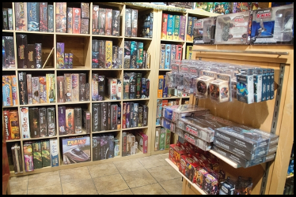

# Desafio 08 - Qual é o nome do jogo?

**Cenário:**

Os personagens de um jogo de tabuleiro criptografaram o seu próprio jogo:

[jogo.tar.gz](jogo.tar.gz)

Um personagem em específico conquistou totalmente um jogo de tabuleiro, descubra qual é o nome desse jogo.

Responda:

a) Qual é o nome do jogo? 

Resposta:

SmallWorld

