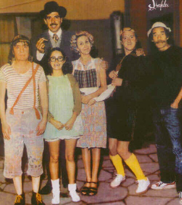

# Desafio 10 - Quem assinou?

**Cenário:**

Cada um dos personagens da turma do Chaves criptografou sua própria frase, porém somente uma assinatura digital foi feita corretamente!

[quem_assinou.tar.gz](quem_assinou.tar.gz)

Responda:

a) Qual era a frase?

b) Quem criptografou a frase?

c) Quem assinou a frase?

Respostas:

A) A vingança nunca é plena, mata a alma e a envenena.

B) Madruga

C) Madruga 

