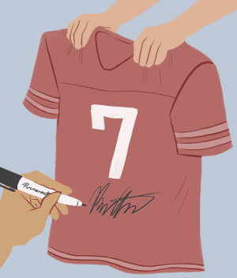

# Desafio 11 - Quem autografou?

**Cenário:**

Um objeto foi autografado por uma pessoa famosa. Encontre o dono do objeto e quem autografou.

[quem_autografou.tar.gz](quem_autografou.tar.gz)

Responda:

a) Quem era o dono do objeto?

b) Quem autografou o objeto? 

Respostas:

1) Mysterious Banksy

2) Donald Trump

