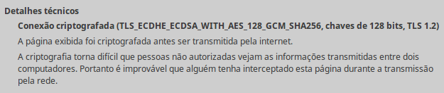
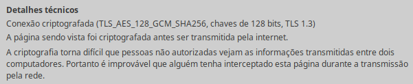
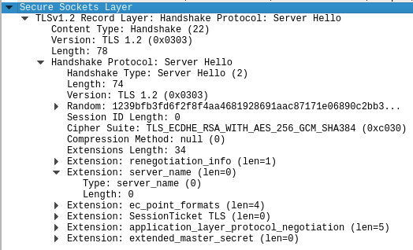

# Lista de Exercícios 15

Acompanhe as videoaulas APNP 15 na [Playlist](https://www.youtube.com/playlist?list=PL4ySOdUYDU9AnsLbtvt7Mq3yBtnMT0Fog).

**Exercício 1**

Quais são os protocolos que compõem o SSL/TLS?

a)
X509 Protocol

HTTP Protocol

TCP Protocol

Ciphers Protocols

b)
Handshake Protocol

ChangeCipherSpec Protocol

Alert Protocol

Record Protocol

c)
Three-way Handshake Protocol

Sliding-window Protocol

Piggybacking Protocol

Checksum Protocol

d)
HTTP

SMTP

TCP

UDP

**Exercício 2**

Quais são as fases que compõe o estabelecimento de sessão SSL/TLS?

a)
Fase 1: cliente e servidor trocam conjunto de cifras e encerram o estabelecimento da sessão.

Fase 2: servidor envia certificado digital (opcional) e troca de chaves.

Fase 3: cliente envia certificado digital (opcional) e troca de chaves.

Fase 4: cliente e servidor definem protocolo, identificação e suite de cifras.

b)
Fase 1: cliente e servidor definem protocolo, identificação e suite de cifras.

Fase 2: cliente envia certificado digital (opcional) e troca de chaves.

Fase 3: servidor envia certificado digital (opcional) e troca de chaves.

Fase 4: cliente e servidor trocam conjunto de cifras e encerram o estabelecimento da sessão.

c)
Fase 1: cliente e servidor definem protocolo, identificação e suite de cifras.

Fase 2: servidor envia certificado digital (opcional) e troca de chaves.

Fase 3: cliente envia certificado digital (opcional) e troca de chaves.

Fase 4: cliente e servidor trocam conjunto de cifras e encerram o estabelecimento da sessão.

d)
Fase 1: cliente e servidor trocam conjunto de cifras e encerram o estabelecimento da sessão.

Fase 2: cliente envia certificado digital (opcional) e troca de chaves.

Fase 3: servidor envia certificado digital (opcional) e troca de chaves.

Fase 4: cliente e servidor definem protocolo, identificação e suite de cifras.

**Exercício 3**

De acordo com a figura abaixo responda:

Para qual fim será utilizado o algoritmo ECDSA nessa sessão TLS? Elliptic Curve DSA.

a) troca de chaves de criptografia

b) criptografia simétrica

c) assinaturas digitais

d) autenticação de mensagens

**Exercício 4**

Em uma sessão SSL, qual protocolo SSL será utilizado para encriptar e encapsular uma informação HTTP segura?

a) Record Protocol

b) Handshake Protocol

c) Alert Protocol

d) ChangeCipherSpec Protocol

**Exercício 5**

De acordo com a figura abaixo responda:

Qual algoritmo de cifra simétrica está sendo utilizado?

a) SHA256

b) AES

c) MD5

d) GCM

e) TLS

**Exercício 6**

Qual protocolo SSL se encarrega de informar que o certificado fornecido por uma das partes expirou?

a) Protocolo de Registro

b) Protocolo de Negociação/Estabelecimento de Sessão

c) Protocolo de Alerta

d) Protocolo de Mudança de Cifra

**Exercício 7**

Responda de acordo com a figura abaixo:

Qual algoritmo foi selecionado para a troca de chaves?

a) ECDHE

b) RSA

c) AES

d) SHA384

Exercício 8

Qual ordem melhor representa o tratamento dos dados de uma aplicação pelo protocolo SSL?

a)
Os dados da aplicação são fragmentados. Depois cada fragmento é cifrado e o cabeçalho de registro SSL é anexado. Assim aplica-se a compactação e, por fim, anexa-se o resumo da autenticação da mensagem.

b)
Os dados da aplicação são fragmentados. Depois cada fragmento é compactado e o cabeçalho de registro SSL é anexado. Assim aplica-se a cifragem e, por fim, anexa-se o resumo da autenticação da mensagem.

c)
Os dados da aplicação são fragmentados. Depois cada fragmento é compactado e o resumo da autenticação da mensagem é anexado. Assim aplica-se a cifragem e, por fim, anexa-se o cabeçalho de registro SSL.

d)
Os dados da aplicação são fragmentados. Depois cada fragmento é cifrado e o resumo da autenticação da mensagem é anexado. Assim aplica-se a compactação e, por fim, anexa-se o cabeçalho de registro SSL. 

Respostas:

1 - b

2 - c

3 - c

4 - a

5 - b

6 - c

7 - a

8 - c

